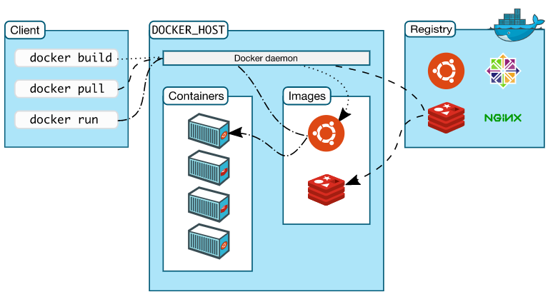
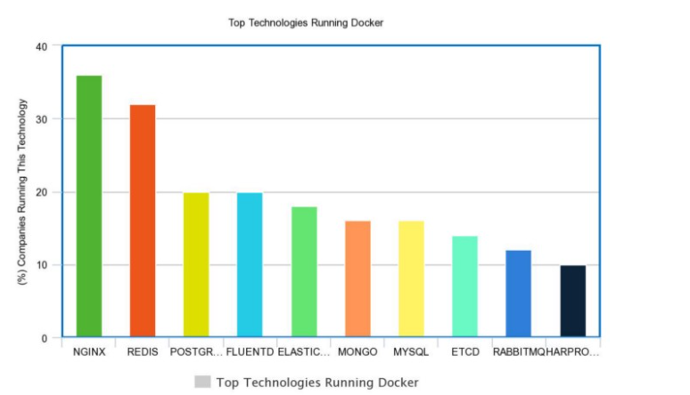
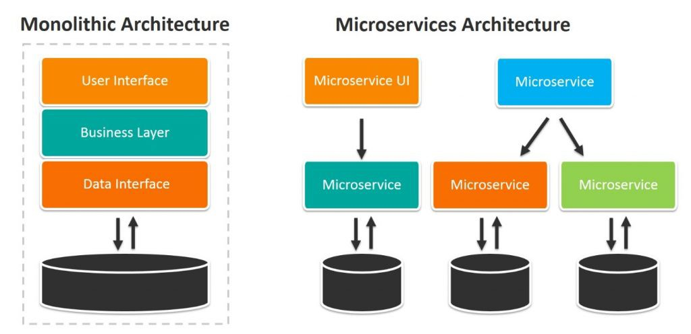
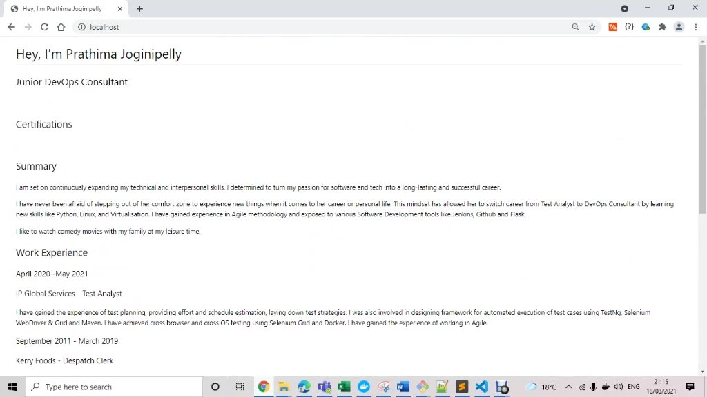
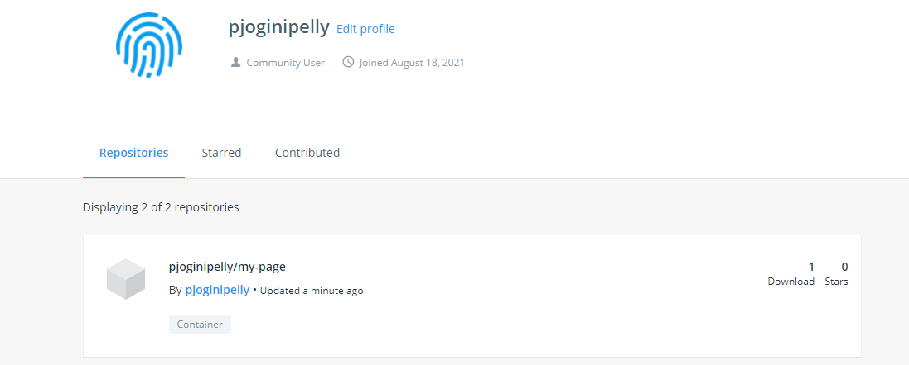

# Docker

## what is Docker?
* Docker is an open platform for developing, shipping, and running applications. Docker enables you to separate your applications from your infrastructure so you can deliver software quickly. With Docker, you can manage your infrastructure in the same ways you manage your applications. 

## Docker Architecture


## Why should we use docker vs VMs?
* Docker streamlines the development lifecycle by allowing developers to work in standardized environments using local containers which provide your applications and services. Containers are great for continuous integration and continuous delivery (CI/CD) workflows. By taking advantage of Docker’s methodologies for shipping, testing, and deploying code quickly, you can significantly reduce the delay between writing code and running it in production.

## what are the benefits?
* Docker’s container-based platform allows for highly portable workloads. Docker containers can run on a developer’s local laptop, on physical or virtual machines in a data center, on cloud providers, or in a mixture of environments.

* Docker’s portability and lightweight nature also make it easy to dynamically manage workloads, scaling up or tearing down applications and services as business needs dictate, in near real time.

## who is using docker?
* The top five companies using Docker are JPMorgan Chase, ThoughtWorks, Inc., Docker, Inc., Neudesic, and SLALOM, LLC.


## what is Micro-services architecture?
* Microservice Architecture is about splitting a large, complex systems vertically (per functional or business requirements) into smaller sub-systems which are processes (hence independently deployable) and these sub-systems communicates with each other via lightweight, language-agnostic network calls either synchronous (e.g. REST, gRPC) or asynchronous (via Messaging) way.
* Microservice architecture, or simply microservices, is a distinctive method of developing software systems that tries to focus on building single-function modules with well-defined interfaces and operations.

## Micro-services architecture vs Monolith and use cases? 


* Unlike microservices, a monolith application is built as a single, autonomous unit. This make changes to the application slow as it affects the entire system.  A modification made to a small section of code might require building and deploying an entirely new version of software.  Scaling specific functions of an application, also means you have to scale the entire application.
* Microservices solve these challenges of monolithic systems by being as modular as possible. In the simplest form, they help build an application as a suite of small services, each running in its own process and are independently deployable. These services may be written in different programming languages and may use different data storage techniques. While this results in the development of systems that are scalable and flexible, it needs a dynamic makeover. 

## Is Micro-services architecture always useful?
* Microservice architecture also brings with it significant overhead in terms of design, interoperability of services, management, and use of system resources. It has a price, and for applications which cannot make sufficient use of its advantages, the price may be too high.
* If complexity isn't your problem, microservices aren't the solution.
* Not all applications are large enough to break down into microservices.

## Docker Commands
* Docker images: Will present the images available
* Docker ps: To check the containers running
* Docker ps -a: To check every container running including hidden files
* Docker pull: to pull the image from docker hub
* Docker run : to run the image live directly from dockerhub
* docker exec -it [container id] bash: to access the running container
* docker stop: stops a running container
* docker kill: kills container by stopping execution. stop gives time to shut down gracefully
* docker commit [container id][username/imagename]: creates new image of an edited container on local system
* docker rm [container id]:removes container
* docker history [image name]: to view history
* docker image rm [image name]: deletes image

### Making docker docs available on our localhost
* docker run -d -p 4000:4000 docs/docker.github.io 

### Logging into a running container
* docker exec -it <container-id/name> sh

### Port mapping in our containers with localhost
* docker run -d -p localhost-port:container-port

### Copying files to container
* docker cp <file to copy> <container_id>:path/to/file

### Running a container with ghost
* docker run -d -p 2368:2368 ghost 

### Running nginx on port 80
* docker run -d -p 80:80 nginx 

* /usr/share/nginx/html has nginx web files

* can replace index.html to alter website appearance

### Replacing nginx default page
* docker cp index.html ae515fa11154:/usr/share/nginx/html

### Setup own nginx
* docker run -d -p 80:80 nginx
* Create your index.html on host
* cd to the file
* docker cp index.html <container-id>:/usr/share/nginx/html
* finished.


### push to docker manually
* docker build -t pjoginipelly/my-page:prathima
* docker tag nginx pjoginipelly/my-page:prathima
* docker commit ae515fa11154 pjoginipelly/my-page:prathima
* docker push pjoginipelly/my-page:prathima


### Automating the process of building an image and pushing to the DockerHub

* nano Dockerfile
```
# build an image to automate the tasks to launch static website page using nginx webserver with Docker
# using nginx webserver with Docker

# user the official image nginx

# label it with your name or email


# copy the folder/file from localhost to the container

# declare to use default port 80 for nginx

# CMD with the final command - as an example npm start

# building customised docker images

# FROM is the keyword to use the image

FROM nginx

# label it with your email or name - this is optional
LABEL MAINTAINER=pjoginipelly@spartaglobal.com

# copy the data as our index.html/app1
COPY index.html /usr/share/nginx/html

# copy app1 to the nginx default index.html

# Now let's add the port

EXPOSE 80

CMD ["nginx", "-g", "daemon off;"]
# we get this from the official image of nginx

```
*  docker build -t pjoginipelly/automatednginx .
- '.'' indicates Dockerfile
* docker push pjoginipelly/automatednginx

## We can run any docker image on the repository on our machine regardless of OS
- Let's delete the images/container locally on our pc by stopping the container and deleting using the below command
* docker stop 4bd14abf3232
* docker rm 4bd14abf3232
- Let's run the image from the dockerhub on our PC
*  docker run -d -p 99:80 pjoginipelly/automatednginx

## Docker Volume
